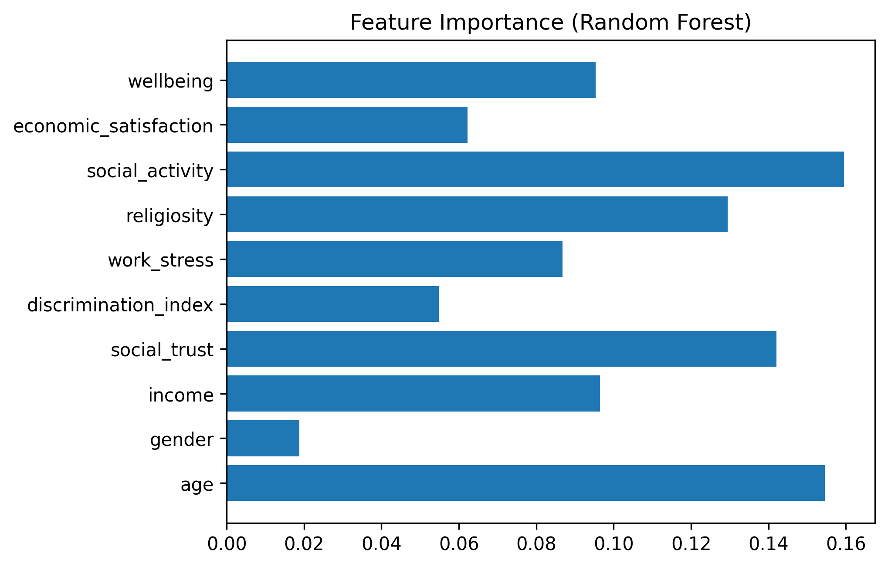
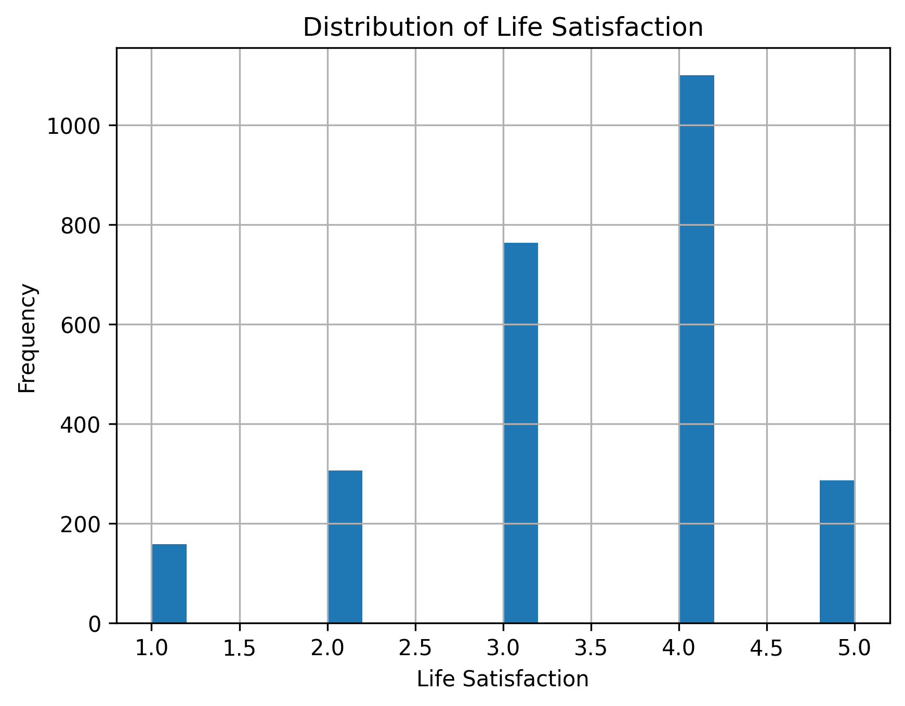
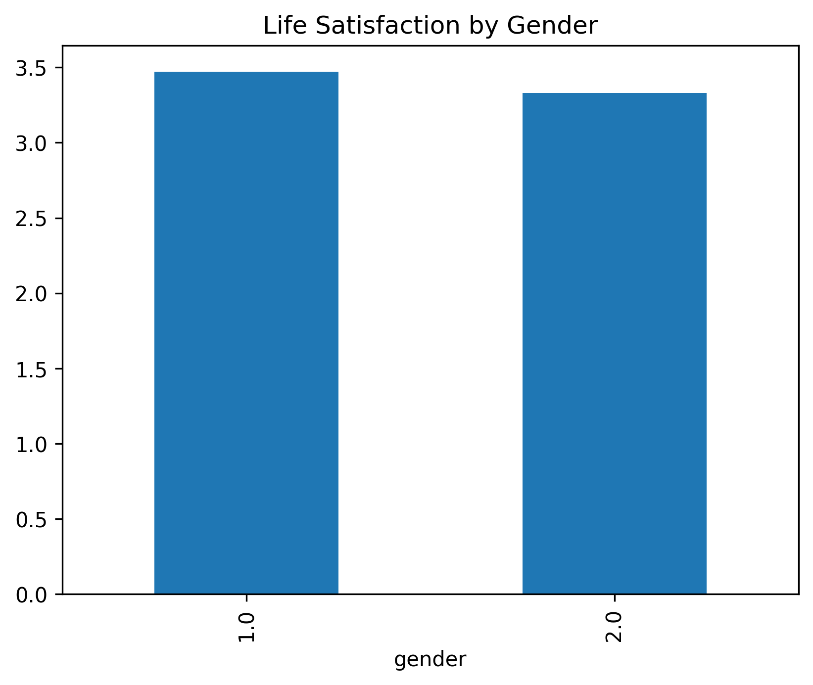
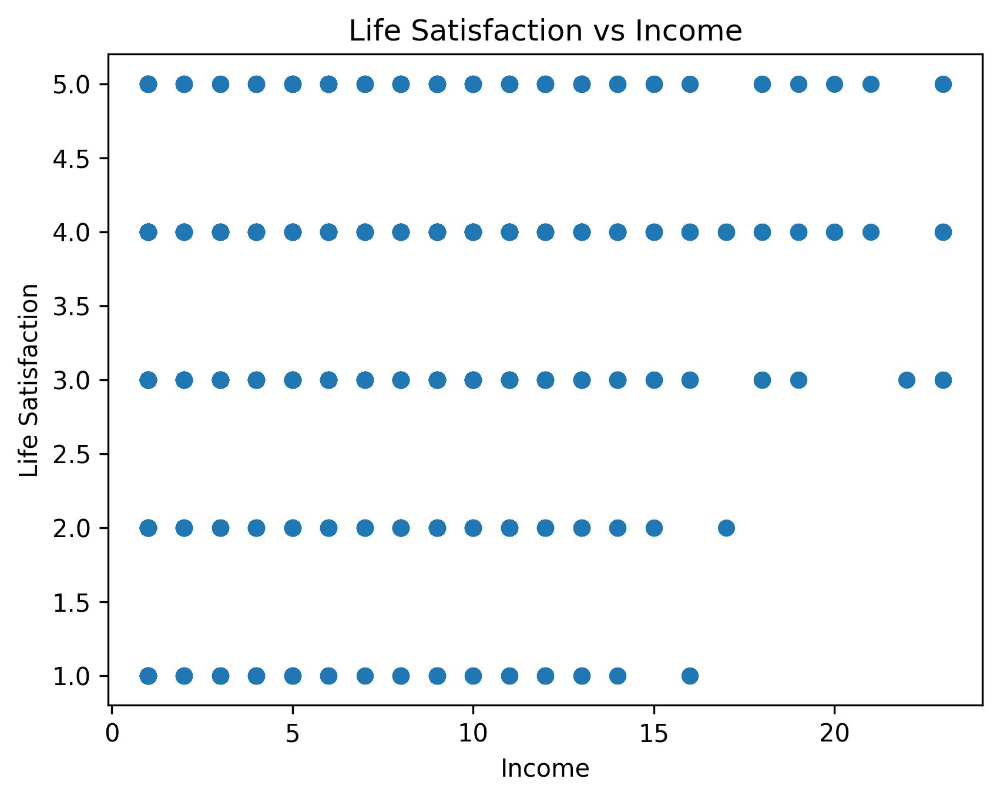
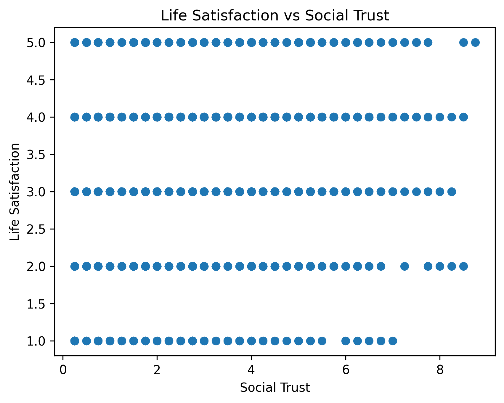
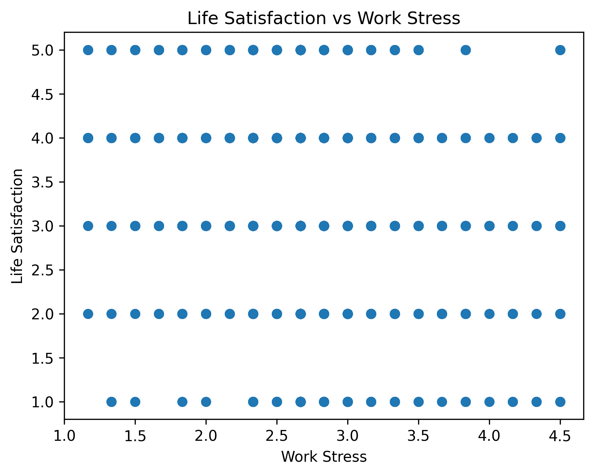
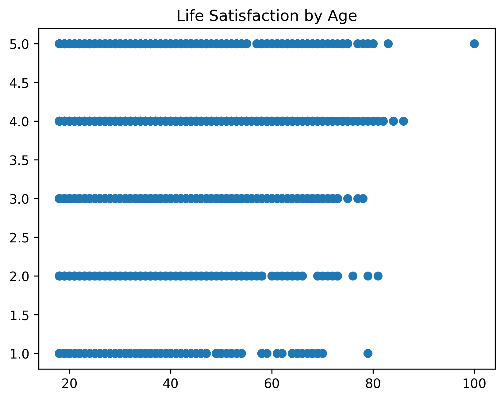
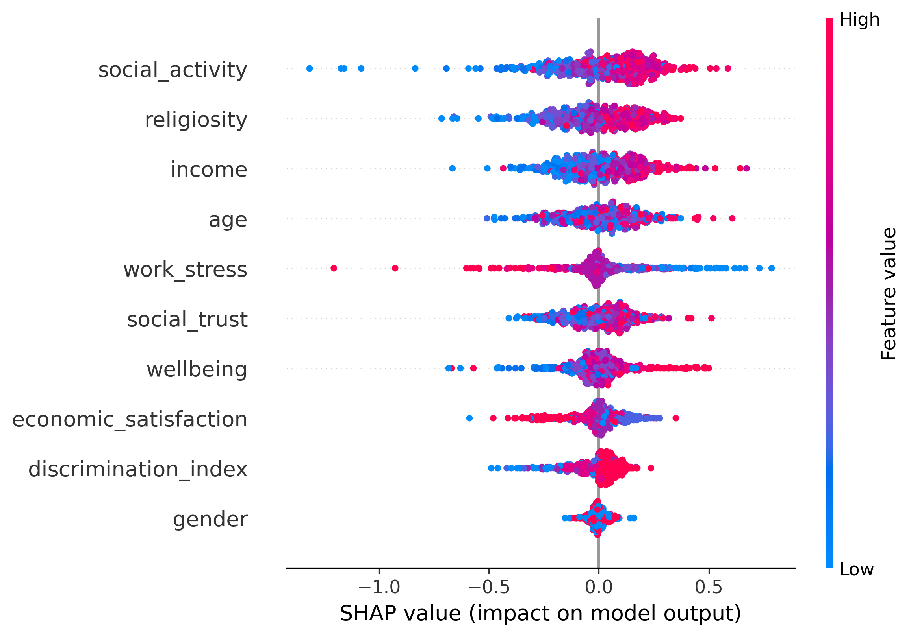
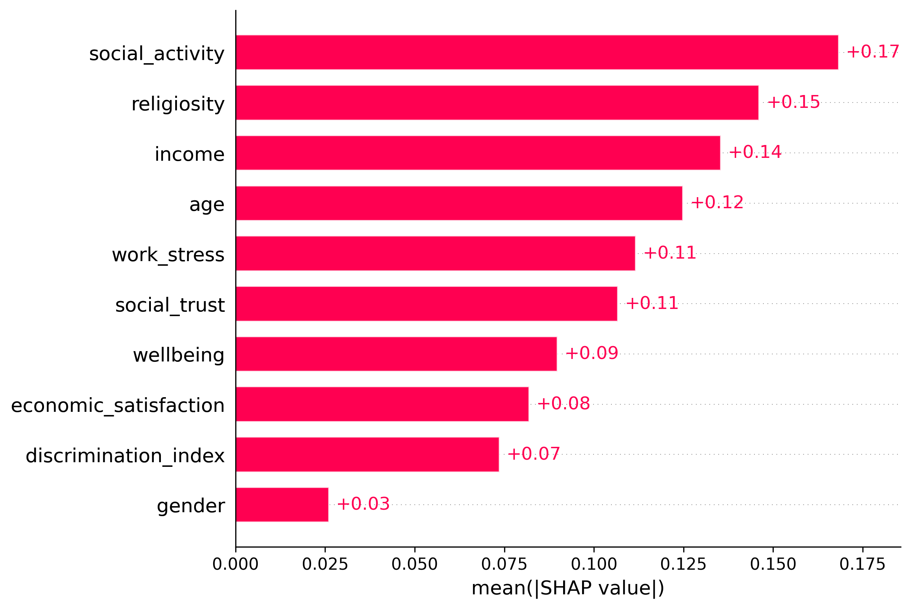
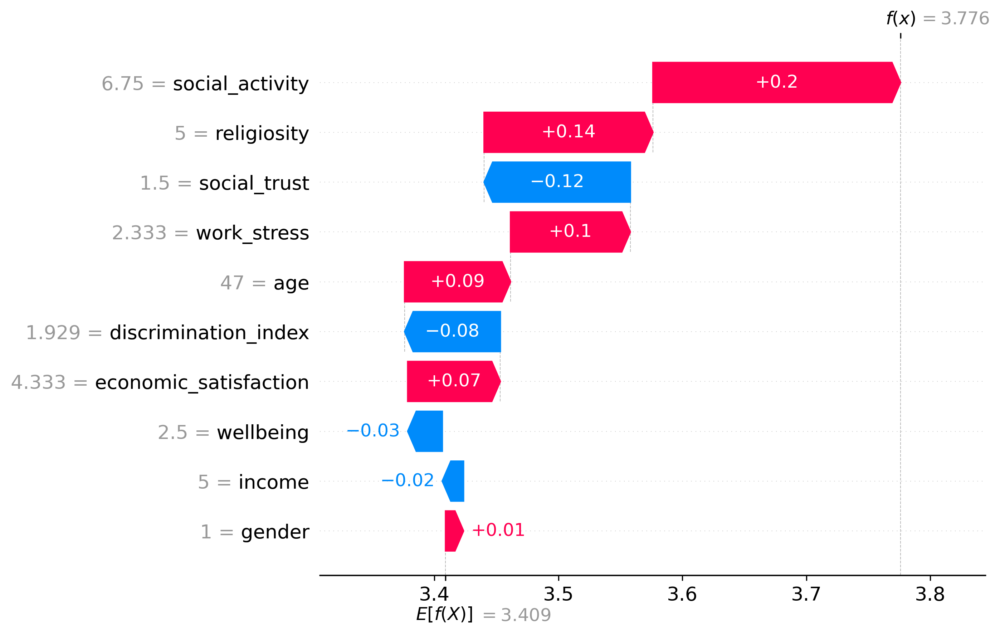

# What Drives Life Satisfaction?

### A Machine Learning & Explainable AI Study

---

## Project Overview

This project explores the key factors that influence **life satisfaction** using a large-scale social survey dataset.(TGSS2024 https://www.tgss.org.tr/iletisim?type=dataset)

By combining **machine learning models** with **explainable AI (SHAP)**, the goal is not only to predict life satisfaction but also to understand *why* people feel more or less satisfied with their lives.

This project includes a command-line interface (CLI) that allows you to run the full machine learning pipeline without modifying code.

You can:

* Train different models
* Save and load trained models
* Export results as JSON
* Control plot generation
* Reproduce experiments easily

---

## Objectives

* Predict individual **life satisfaction (`lifesat`)**
* Identify the most important **social, economic, and psychological factors**
* Provide **interpretable insights** using explainable AI techniques

---

## Dataset

The dataset contains hundreds of variables related to:

* Demographics (age, gender, education)
* Social trust and relationships
* Work and income
* Religion and beliefs
* Health and well-being
* Political and social attitudes

⚠️ The dataset required extensive preprocessing due to:

* Special missing values (`-90`, `-88`, `-99`)
* High dimensionality (500+ columns)

---

## Data Preprocessing

Key steps:

* Converted special values (`-90`, `-88`, `-99`) → `NaN`
* Removed columns with high missing rates
* Imputed remaining missing values using median
* Reduced dimensionality through feature engineering

---

## Feature Engineering

Raw survey data was transformed into meaningful indices:

* **Social Trust Index** → trust in people, fairness, neighbors
* **Discrimination Index** → perceived discrimination across groups
* **Work Stress Index** → stress, fatigue, work-life balance
* **Religiosity Score** → religious practices and beliefs
* **Social Activity Score** → frequency of social interactions
* **Economic Satisfaction** → income and job satisfaction

This reduced 500+ variables into a compact, interpretable feature set.

---

## How To Run

All commands should be executed from the project root:

```sh
python -m src.cli
```
## Available Models
You can choose between:

* linear → Linear Regression
* rf → Random Forest (default)
* xgb → XGBoost
## CLI Usage Examples
🔹 Train a model
```sh
python -m src.cli --model-type rf
```
🔹 Train and save model
```sh
python -m src.cli --model-type rf --save-model
```
🔹 Save results as JSON
```sh
python -m src.cli --save-json
```
🔹 Save both model and results
```sh
python -m src.cli --model-type xgb --save-model --save-json
```
🔹 Load a trained model
```sh
python -m src.cli --load-model --model-path models/model.pkl
```
🔹 Load results from JSON
```sh
python -m src.cli --load-json
```
🔹 Disable plots
```sh
python -m src.cli --no-plot
```
🔹 Custom output paths
```sh
python -m src.cli \
  --model-type xgb \
  --save-model \
  --save-json \
  --model-path models/xgb_model.pkl \
  --json-path models/xgb_results.json \
  --output-dir results/
```
## How It Works
* Loads dataset from data/
* Cleans and preprocesses data
* Trains or loads a model
* Evaluates performance (MAE)
## Saves:
* Model (.pkl)
* Results (.json)
* Plots (.png)
* Output Files
* Models
* models/model.pkl
* Results (JSON)
* models/results.json

## Example:
```json
{
    "model_type": "rf",
    "mae": 0.85
}
```
* Plots
results/lifesat_distribution.png

---

## Exploratory Data Analysis

### Feature Importance


### Life Satisfaction Distribution


### Life Satisfaction by Gender


### Life Satisfaction vs Income


### Life Satisfaction vs Social Trust


### Life Satisfaction vs Work Stress


### Life Satisfaction by Age


### SHAP Summary


### SHAP Feature Importance


### SHAP Individual Explanation


## Machine Learning Models

Three models were trained and evaluated:

* Linear Regression (baseline)
* Random Forest Regressor
* XGBoost Regressor

### Model Performance (MAE)

| Model             | MAE          |
| ----------------- | ------------ |
| Linear Regression | 0.7439083518939844 |
| Random Forest     | 0.7508413001912044 |
| XGBoost           | 0.8352283612036112 |

👉 Tree-based models outperformed linear regression, indicating **non-linear relationships** in the data.

---

## Feature Importance

### Random Forest Feature Importance


---

## Explainability with SHAP

To understand model predictions, SHAP (SHapley Additive exPlanations) was used.

### SHAP Summary Plot


---

### SHAP Feature Importance


---

## Key Findings

* **Social trust** is one of the strongest predictors of life satisfaction
* **Work stress** has a significant negative impact
* **Economic satisfaction** contributes positively but less than social factors
* **Social activity** is strongly associated with higher well-being

👉 Overall, **social and psychological factors outweigh purely economic ones**

---

## Conclusion

This project demonstrates that:

> Life satisfaction is driven more by **human relationships and trust** than by material factors alone.

By combining machine learning with explainability, we can uncover meaningful insights about society—not just make predictions.

---

## Technologies Used

* Python
* pandas, numpy
* matplotlib, seaborn
* scikit-learn
* XGBoost
* SHAP

---

## 📁 Project Structure

```
life-satisfaction-ml/
│
├── data/
├── notebooks/
├── results/
├── models/
├── src/
├── requirements.txt
└── README.md
```

---

## Future Improvements

* Hyperparameter tuning
* Cross-validation
* Deploying as a web app (Streamlit)
* Interactive dashboard (Power BI / Tableau)

---

## Author

Cetin ERDEM

---

## ⭐ If you found this project interesting

Feel free to ⭐ the repo and connect!
